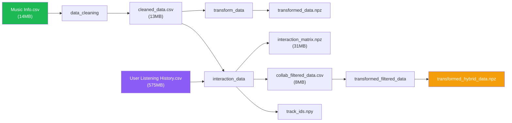

<div align="center">

# 🎵 SONIC — Hybrid Music Recommender

**A production-grade music recommendation engine that blends content-based acoustics with collaborative filtering from real user listening data.**

[](https://sonic-recommender.vercel.app)
[](https://sonic-recommender-api.onrender.com/docs)
[](https://python.org)
[](https://react.dev)
[](https://fastapi.tiangolo.com)
[](https://dvc.org)

</div>

---

## 🏗️ System Architecture

```
┌──────────────────────────────────────────────────────────────────┐
│  Frontend (Vercel CDN)                                           │
│  React 19 + Vite + Framer Motion + TanStack Query               │
│  ┌─────────────┐  ┌──────────────┐  ┌─────────────────────┐     │
│  │ SeedSearch   │  │ WeightSlider │  │ TrackCard + Preview │     │
│  │ (autocomplete│  │ (presets +   │  │ (audio features +   │     │
│  │  + fuzzy)    │  │  fine-tune)  │  │  Spotify preview)   │     │
│  └──────┬───────┘  └──────┬───────┘  └─────────────────────┘     │
│         │                 │                                      │
│  ┌──────┴─────────────────┴──────────────────────────────────┐   │
│  │  TanStack Query Cache (5 min stale, keyed by song+weights)│   │
│  └──────────────────────────┬────────────────────────────────┘   │
└─────────────────────────────┼────────────────────────────────────┘
                              │ HTTPS
┌─────────────────────────────┼────────────────────────────────────┐
│  Backend (Render)           │                                    │
│  FastAPI + uvicorn          ▼                                    │
│  ┌────────────────────────────────────────────────────────────┐  │
│  │  /api/search         → Fuzzy song matching (rapidfuzz)     │  │
│  │  /api/search-artists → Fuzzy artist matching + songs list  │  │
│  │  /api/recommend      → Hybrid recommendation pipeline      │  │
│  └────────────────────────────┬───────────────────────────────┘  │
│                               │                                  │
│  ┌────────────────────────────┴───────────────────────────────┐  │
│  │  In-Memory Cache (loaded once at startup via lifespan)     │  │
│  │  ├── collab_filtered_data.csv  (75K tracks)                │  │
│  │  ├── interaction_matrix.npz    (user-item sparse matrix)   │  │
│  │  ├── transformed_hybrid_data.npz (TF-IDF + scaled feats)  │  │
│  │  └── track_ids.npy             (index mapping)             │  │
│  └────────────────────────────────────────────────────────────┘  │
└──────────────────────────────────────────────────────────────────┘
```

---

## ⚙️ How the Algorithms Work

### 1. Content-Based Filtering
Analyzes **audio features** (danceability, energy, valence, tempo, acousticness, etc.) and **text tags** using:
- **TF-IDF vectorization** on categorical features (tags, key, mode)
- **Standard scaling** on continuous audio features
- **Cosine similarity** to find acoustically similar tracks

### 2. Collaborative Filtering
Learns from **1M+ real user listening sessions**:
- Constructs a sparse **user-item interaction matrix**
- Computes **item-item similarity** via dot-product on the interaction matrix
- Finds tracks that users with similar taste frequently listen to together

### 3. Hybrid Engine
Combines both approaches with **adjustable weights**:
1. Compute content-based similarity scores
2. Compute collaborative similarity scores
3. **Rank-normalize** both score vectors (percentile-based)
4. Weighted combination: `score = w₁ × content_rank + w₂ × collab_rank`
5. Return top-K by combined score

Users can adjust `w₁` and `w₂` in real-time via the UI — with results cached by weight position.

---

## 🛠️ Tech Stack

| Layer | Technologies |
|---|---|
| **Frontend** | React 19, Vite 8, TypeScript, Framer Motion, TanStack Query, Tailwind CSS |
| **Backend** | FastAPI, uvicorn, Pydantic v2 |
| **ML Pipeline** | scikit-learn, scipy (sparse matrices), Dask, category_encoders, rapidfuzz |
| **Data Pipeline** | DVC (Data Version Control) — 4-stage reproducible pipeline |
| **Deployment** | Docker, Render (backend), Vercel (frontend) |

---

## 🔄 DVC Data Pipeline



Reproduce the full pipeline:
```bash
dvc repro
```

---

## 🚀 Local Development

### Prerequisites
- Python 3.9+
- Node.js 20+

### Backend
```bash
# Create virtual environment
python -m venv venv
source venv/bin/activate  # macOS/Linux

# Install dependencies
pip install -r requirements.txt

# Start the API server (loads ~42MB of data into memory)
uvicorn server:app --reload
# → http://localhost:8000/docs (Swagger UI)
```

### Frontend
```bash
cd frontend
npm install
npm run dev
# → http://localhost:5173
```

### Environment Variables
| Variable | Where | Default | Description |
|---|---|---|---|
| `VITE_API_URL` | Frontend | `http://localhost:8000` | Backend API base URL |
| `PORT` | Backend | `8000` | Server port (set by Render in production) |

---

## 📁 Project Structure

```
├── server.py                    # FastAPI backend (API + lifespan caching)
├── hybrid_recommendations.py    # Core hybrid engine (rank-normalized blending)
├── content_based_filtering.py   # TF-IDF + cosine similarity pipeline
├── collaborative_filtering.py   # User-item interaction matrix pipeline
├── fuzzy_search.py              # Song resolution via rapidfuzz
├── data_cleaning.py             # Raw data preprocessing
├── transform_filtered_data.py   # Hybrid matrix transformer
├── Dockerfile                   # Docker build for Render deployment
├── render.yaml                  # Render Blueprint (IaC)
├── dvc.yaml                     # DVC pipeline definition (4 stages)
├── dvc.lock                     # DVC pipeline state + hashes
├── requirements.txt             # Python dependencies
│
├── runtime_data/                # Precomputed data for Docker (git-tracked)
│   ├── collab_filtered_data.csv
│   ├── interaction_matrix.npz
│   ├── transformed_hybrid_data.npz
│   └── track_ids.npy
│
├── data/                        # Full data directory (DVC-tracked, gitignored)
│   ├── Music Info.csv
│   ├── User Listening History.csv
│   └── ... (pipeline outputs)
│
└── frontend/                    # React SPA
    ├── vercel.json              # Vercel deployment config
    ├── src/
    │   ├── App.tsx              # Main app (landing + results dashboard)
    │   ├── lib/
    │   │   ├── api.js           # Typed API client
    │   │   └── hooks.js         # React Query hooks (cached, debounced)
    │   └── components/
    │       ├── SeedSearch.tsx    # Dual autocomplete (song + artist)
    │       ├── TrackCard.tsx     # Audio preview + feature visualizer
    │       ├── WeightSlider.tsx  # Preset modes + fine-tune slider
    │       └── LoadingGate.tsx   # ML pipeline animation
    └── package.json
```

---

## 📊 Key Features

- **Hybrid recommendations** with real-time adjustable content vs. collaborative weights
- **Fuzzy autocomplete** for both songs and artists with live dropdown
- **Audio preview playback** using Spotify preview URLs (30s clips)
- **Audio feature visualization** — danceability, energy, valence, tempo
- **Smart caching** — TanStack Query caches by `(song, artist, weights)` key; identical queries are instant
- **Debounced search** — 300ms debounce prevents API spam while typing
- **Preset weight modes** — Discovery, Balanced, Personal with one-click presets

---

## 📄 License

This project is for educational purposes. Song metadata and listening history are from the [Spotify Million Playlist Dataset](https://www.aicrowd.com/challenges/spotify-million-playlist-dataset-challenge).
